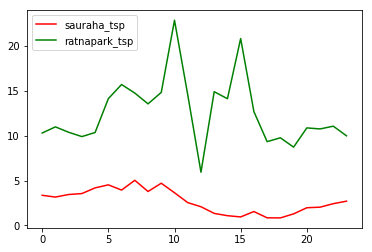
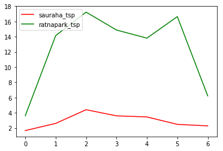
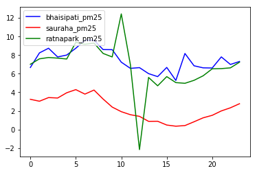
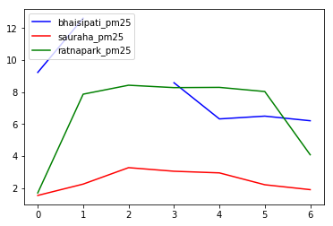
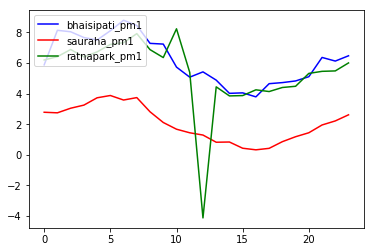
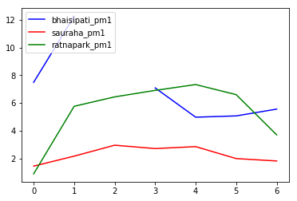
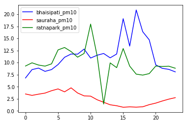
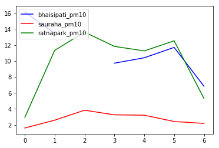
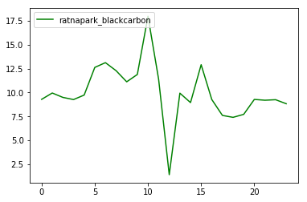

```python
import pandas as pd
import numpy as np
import matplotlib.pyplot as plt
import matplotlib.dates
import pylab 
```


```python
import datetime
import calendar
```


```python
#findDay function for days

def findDay(date): 
    born = datetime.datetime.strptime(date, '%Y %m %d').weekday() 
    return (calendar.day_name[born]) 
  
```


```python
#import csv

df_bhaisipati = pd.read_csv('bhaisipati_ktm.csv')
df_ratnapark = pd.read_csv('Ratnapark.csv')
df_sauraha = pd.read_csv('Sauraha_Chitwan.csv')
# df
```


```python
#update dataframe with day

#bhaisipati
local_date_time_bhaisipati = df_bhaisipati.localDateTime
local_date_bhaisipati = [x[:10].replace("-"," ") for x in local_date_time_bhaisipati]
df_bhaisipati["Day"] = [findDay(local_date_i) for local_date_i in local_date_bhaisipati]
# df.columns

#Sauraha
local_date_time_sauraha = df_sauraha.localDateTime
local_date_sauraha = [x[:10].replace("-"," ") for x in local_date_time_sauraha]
df_sauraha["Day"] = [findDay(local_date_i) for local_date_i in local_date_sauraha]

#Ratnapark
local_date_time_ratnapark = df_ratnapark.localDateTime
local_date_ratnapark = [x[:10].replace("-"," ") for x in local_date_time_ratnapark]
df_ratnapark["Day"] = [findDay(local_date_i) for local_date_i in local_date_ratnapark]
```


```python
#divide data in 4 time periods Morning, Afternoon, Evening, Night 

# bhaisipati
x = list(df_bhaisipati["localDateTime"])
hr = []
num_hr = []
for i in x:
    a1 = i.split(" ")
    date = a1[0]
    time = a1[1]
    hour = time.split(":")
    if int(hour[0])>=6 and int(hour[0])<=12:
        hr.append("Morning")
    elif int(hour[0])>12 and int(hour[0])<=17:
        hr.append("Afternoon")
    elif int(hour[0])>17 and int(hour[0])<=20:
        hr.append("Evening")
    else:
        hr.append("Night")
    
    num_hr.append(int(hour[0]))
        
df_bhaisipati["Time_section"] = hr
df_bhaisipati["time_hourly"] = num_hr


# sauraha
x = list(df_sauraha["localDateTime"])
hr = []
num_hr = []
for i in x:
    a1 = i.split(" ")
    date = a1[0]
    time = a1[1]
    hour = time.split(":")
    if int(hour[0])>=6 and int(hour[0])<=12:
        hr.append("Morning")
    elif int(hour[0])>12 and int(hour[0])<=17:
        hr.append("Afternoon")
    elif int(hour[0])>17 and int(hour[0])<=20:
        hr.append("Evening")
    else:
        hr.append("Night")
    
    num_hr.append(int(hour[0]))
        
df_sauraha["Time_section"] = hr
df_sauraha["time_hourly"] = num_hr


# ratnapark
x = list(df_ratnapark["localDateTime"])
hr = []
num_hr = []
for i in x:
    a1 = i.split(" ")
    date = a1[0]
    time = a1[1]
    hour = time.split(":")
    if int(hour[0])>=6 and int(hour[0])<=12:
        hr.append("Morning")
    elif int(hour[0])>12 and int(hour[0])<=17:
        hr.append("Afternoon")
    elif int(hour[0])>17 and int(hour[0])<=20:
        hr.append("Evening")
    else:
        hr.append("Night")
    
    num_hr.append(int(hour[0]))
        
df_ratnapark["Time_section"] = hr
df_ratnapark["time_hourly"] = num_hr

# df_bhaisipati
# df_ratnapark
# df_sauraha
```


```python
#finding parameters value in each csv

df_parameters_unique_bhaisipati = df_bhaisipati.parameters.unique()
df_parameters_unique_ratnapark = df_ratnapark.parameters.unique()
df_parameters_unique_sauraha = df_sauraha.parameters.unique()
print(df_parameters_unique_bhaisipati)
print(df_parameters_unique_ratnapark)
print(df_parameters_unique_sauraha)
```

    ['tsp' 'pm1' 'pm10' 'pm25']
    ['tsp' 'pm1' 'pm10' 'pm25' 'blackcarbon']
    ['tsp' 'pm1' 'pm10' 'pm25']


```python
#Creating sub-dataframes according to parameters value

#bhaisipati
df_bhaisipati_tsp = df_bhaisipati[df_bhaisipati.parameters=="tsp"]
df_bhaisipati_pm25 = df_bhaisipati[df_bhaisipati.parameters=="pm25"]
df_bhaisipati_pm1 = df_bhaisipati[df_bhaisipati.parameters=="pm1"]
df_bhaisipati_pm10 = df_bhaisipati[df_bhaisipati.parameters=="pm10"]

#sauraha
df_sauraha_tsp = df_sauraha[df_sauraha.parameters=="tsp"]
df_sauraha_pm25 = df_sauraha[df_sauraha.parameters=="pm25"]
df_sauraha_pm1 = df_sauraha[df_sauraha.parameters=="pm1"]
df_sauraha_pm10 = df_sauraha[df_sauraha.parameters=="pm10"]  


#ratnapark
df_ratnapark_tsp = df_ratnapark[df_ratnapark.parameters=="tsp"]
df_ratnapark_pm25 = df_ratnapark[df_ratnapark.parameters=="pm25"]
df_ratnapark_pm1 = df_ratnapark[df_ratnapark.parameters=="pm1"]
df_ratnapark_pm10 = df_ratnapark[df_ratnapark.parameters=="pm10"]
df_ratnapark_blackcarbon = df_ratnapark[df_ratnapark.parameters=="blackcarbon"]


# df_bhaisipati_tsp
# df_ratnapark_tsp.value.max()
# df_sauraha_tsp

```


```python
#tsp_values dataframe for all 3  #mean_hourly

#bhaisipati
mean_val_1 =[]
x_hour = []
x_week =[]
week_days = ['Sunday','Monday','Tuesday','Wednesday','Thursday','Friday','Saturday']
mean_val_1_week =[]
for i in range(24):
    x_hour.append(i)
    mean_val_1.append(df_bhaisipati_tsp.loc[df_bhaisipati_tsp['time_hourly'] == i].value.mean())

x = list(df_bhaisipati_tsp["time_hourly"])
mean_list_1 = [0]* len(x)
for idx, val in enumerate(x):
    mean_list_1[idx]=mean_val_1[val]
    
df_bhaisipati_tsp["mean_hourly"] = mean_list_1

    
for j in range(7):
    x_week.append(j)
    mean_val_1_week.append(df_bhaisipati_tsp.loc[df_bhaisipati_tsp['Day'] == week_days[j]].value.mean())
    
    
x_1 = list(df_bhaisipati_tsp["Day"])
mean_list_1_week = [0] * len(x_1)
for idx, val in enumerate(x_1):
    mean_list_1_week[idx]=mean_val_1_week[week_days.index(val)]
    
    
df_bhaisipati_tsp["mean_days"] = mean_list_1_week

# pylab.plot(x_hour, mean_val_1, '-b', label='bhaisipati_tsp')

#sauraha  
mean_val_2 =[]
for i in range(24):
    mean_val_2.append(df_sauraha_tsp.loc[df_sauraha_tsp['time_hourly'] == i].value.mean())
    
x = list(df_sauraha_tsp["time_hourly"])   
mean_list_2 = [0]* len(x)
for idx, val in enumerate(x):
    mean_list_2[idx]=mean_val_2[val]
    
df_sauraha_tsp["mean_hourly"] = mean_list_2

mean_val_2_week =[]
for j in range(7):
    mean_val_2_week.append(df_sauraha_tsp.loc[df_sauraha_tsp['Day'] == week_days[j]].value.mean())
    
    
x_1 = list(df_sauraha_tsp["Day"])
mean_list_2_week = [0] * len(x_1)
for idx, val in enumerate(x_1):
    mean_list_2_week[idx]=mean_val_2_week[week_days.index(val)]
    
df_sauraha_tsp["mean_days"] = mean_list_2_week
pylab.plot(x_hour, mean_val_2, '-r', label='sauraha_tsp')


#ratnapark 
mean_val_3 =[]
for i in range(24):
    mean_val_3.append(df_ratnapark_tsp.loc[df_ratnapark_tsp['time_hourly'] == i].value.mean())
    
x = list(df_ratnapark_tsp["time_hourly"]) 
mean_list_3 = [0]* len(x)
for idx, val in enumerate(x):
    mean_list_3[idx]=mean_val_3[val]
    
df_ratnapark_tsp["mean_hourly"] = mean_list_3 

mean_val_3_week =[]
for j in range(7):
    mean_val_3_week.append(df_ratnapark_tsp.loc[df_ratnapark_tsp['Day'] == week_days[j]].value.mean())
    
    
x_1 = list(df_ratnapark_tsp["Day"])
mean_list_3_week = [0] * len(x_1)
for idx, val in enumerate(x_1):
    mean_list_3_week[idx]=mean_val_3_week[week_days.index(val)]
    
df_ratnapark_tsp["mean_days"] = mean_list_3_week
pylab.plot(x_hour, mean_val_3, '-g', label='ratnapark_tsp')

pylab.legend(loc='upper left')
pylab.show()

```

    /home/ashish/anaconda3/lib/python3.7/site-packages/ipykernel_launcher.py:18: SettingWithCopyWarning: 
    A value is trying to be set on a copy of a slice from a DataFrame.
    Try using .loc[row_indexer,col_indexer] = value instead
    
    See the caveats in the documentation: http://pandas.pydata.org/pandas-docs/stable/indexing.html#indexing-view-versus-copy
    /home/ashish/anaconda3/lib/python3.7/site-packages/ipykernel_launcher.py:32: SettingWithCopyWarning: 
    A value is trying to be set on a copy of a slice from a DataFrame.
    Try using .loc[row_indexer,col_indexer] = value instead
    
    See the caveats in the documentation: http://pandas.pydata.org/pandas-docs/stable/indexing.html#indexing-view-versus-copy
    /home/ashish/anaconda3/lib/python3.7/site-packages/ipykernel_launcher.py:46: SettingWithCopyWarning: 
    A value is trying to be set on a copy of a slice from a DataFrame.
    Try using .loc[row_indexer,col_indexer] = value instead
    
    See the caveats in the documentation: http://pandas.pydata.org/pandas-docs/stable/indexing.html#indexing-view-versus-copy
    /home/ashish/anaconda3/lib/python3.7/site-packages/ipykernel_launcher.py:58: SettingWithCopyWarning: 
    A value is trying to be set on a copy of a slice from a DataFrame.
    Try using .loc[row_indexer,col_indexer] = value instead
    
    See the caveats in the documentation: http://pandas.pydata.org/pandas-docs/stable/indexing.html#indexing-view-versus-copy
    /home/ashish/anaconda3/lib/python3.7/site-packages/ipykernel_launcher.py:72: SettingWithCopyWarning: 
    A value is trying to be set on a copy of a slice from a DataFrame.
    Try using .loc[row_indexer,col_indexer] = value instead
    
    See the caveats in the documentation: http://pandas.pydata.org/pandas-docs/stable/indexing.html#indexing-view-versus-copy
    /home/ashish/anaconda3/lib/python3.7/site-packages/ipykernel_launcher.py:84: SettingWithCopyWarning: 
    A value is trying to be set on a copy of a slice from a DataFrame.
    Try using .loc[row_indexer,col_indexer] = value instead
    
    See the caveats in the documentation: http://pandas.pydata.org/pandas-docs/stable/indexing.html#indexing-view-versus-copy





```python
# pylab.plot(x_week, mean_val_1_week, '-b', label='bhaisipati_tsp')
pylab.plot(x_week, mean_val_2_week, '-r', label='sauraha_tsp')
pylab.plot(x_week, mean_val_3_week, '-g', label='ratnapark_tsp')
pylab.legend(loc='upper left')
pylab.show()

```





```python
colors=["gold","yellow","green","lightcoral","lightskyblue","red","cyan"]
plt.pie(mean_val_2_week,labels=week_days,colors=colors,autopct='%1.1f%%',shadow=True, startangle=90)
plt.axis('equal')
plt.show()
```


```python
##pm25_values dataframe for all 3  #mean_hourly

#bhaisipati
mean_val_1 =[]
mean_val_1_week = []
x_hour = []
for i in range(24):
    x_hour.append(i)
    mean_val_1.append(df_bhaisipati_pm25.loc[df_bhaisipati_pm25['time_hourly'] == i].value.mean())
    
x = list(df_bhaisipati_pm25["time_hourly"])
mean_list_1 = [0]* len(x)
for idx, val in enumerate(x):
    mean_list_1[idx]=mean_val_1[val]
    
df_bhaisipati_pm25["mean_hourly"] = mean_list_1

for j in range(7):
    mean_val_1_week.append(df_bhaisipati_pm25.loc[df_bhaisipati_pm25['Day'] == week_days[j]].value.mean())
    
    
x_1 = list(df_bhaisipati_pm25["Day"])
mean_list_1_week = [0] * len(x_1)
for idx, val in enumerate(x_1):
    mean_list_1_week[idx]=mean_val_1_week[week_days.index(val)]
    
    
df_bhaisipati_pm25["mean_days"] = mean_list_1_week
pylab.plot(x_hour, mean_val_1, '-b', label='bhaisipati_pm25')


#sauraha  
mean_val_2 =[]
for i in range(24):
    mean_val_2.append(df_sauraha_pm25.loc[df_sauraha_pm25['time_hourly'] == i].value.mean())
    
x = list(df_sauraha_pm25["time_hourly"])   
mean_list_2 = [0]* len(x)
for idx, val in enumerate(x):
    mean_list_2[idx]=mean_val_2[val]
    
df_sauraha_pm25["mean_hourly"] = mean_list_2

mean_val_2_week =[]
for j in range(7):
    mean_val_2_week.append(df_sauraha_pm25.loc[df_sauraha_pm25['Day'] == week_days[j]].value.mean())
    
    
x_1 = list(df_sauraha_pm25["Day"])
mean_list_2_week = [0] * len(x_1)
for idx, val in enumerate(x_1):
    mean_list_2_week[idx]=mean_val_2_week[week_days.index(val)]
    
df_sauraha_pm25["mean_days"] = mean_list_2_week
pylab.plot(x_hour, mean_val_2, '-r', label='sauraha_pm25')


#ratnapark 
mean_val_3 =[]
for i in range(24):
    mean_val_3.append(df_ratnapark_pm25.loc[df_ratnapark_pm25['time_hourly'] == i].value.mean())
    
x = list(df_ratnapark_pm25["time_hourly"]) 
mean_list_3 = [0]* len(x)
for idx, val in enumerate(x):
    mean_list_3[idx]=mean_val_3[val]
    
df_ratnapark_pm25["mean_hourly"] = mean_list_3 

mean_val_3_week =[]
for j in range(7):
    mean_val_3_week.append(df_ratnapark_pm25[df_ratnapark_pm25['Day'] == week_days[j]].value.mean())
    
    
x_1 = list(df_ratnapark_pm25["Day"])
mean_list_3_week = [0] * len(x_1)
for idx, val in enumerate(x_1):
    mean_list_3_week[idx]=mean_val_3_week[week_days.index(val)]
    
df_ratnapark_pm25["mean_days"] = mean_list_3_week
pylab.plot(x_hour, mean_val_3, '-g', label='ratnapark_pm25')

pylab.legend(loc='upper left')
pylab.show()

```

    /home/ashish/anaconda3/lib/python3.7/site-packages/ipykernel_launcher.py:16: SettingWithCopyWarning: 
    A value is trying to be set on a copy of a slice from a DataFrame.
    Try using .loc[row_indexer,col_indexer] = value instead
    
    See the caveats in the documentation: http://pandas.pydata.org/pandas-docs/stable/indexing.html#indexing-view-versus-copy
      app.launch_new_instance()
    /home/ashish/anaconda3/lib/python3.7/site-packages/ipykernel_launcher.py:28: SettingWithCopyWarning: 
    A value is trying to be set on a copy of a slice from a DataFrame.
    Try using .loc[row_indexer,col_indexer] = value instead
    
    See the caveats in the documentation: http://pandas.pydata.org/pandas-docs/stable/indexing.html#indexing-view-versus-copy
    /home/ashish/anaconda3/lib/python3.7/site-packages/ipykernel_launcher.py:42: SettingWithCopyWarning: 
    A value is trying to be set on a copy of a slice from a DataFrame.
    Try using .loc[row_indexer,col_indexer] = value instead
    
    See the caveats in the documentation: http://pandas.pydata.org/pandas-docs/stable/indexing.html#indexing-view-versus-copy
    /home/ashish/anaconda3/lib/python3.7/site-packages/ipykernel_launcher.py:54: SettingWithCopyWarning: 
    A value is trying to be set on a copy of a slice from a DataFrame.
    Try using .loc[row_indexer,col_indexer] = value instead
    
    See the caveats in the documentation: http://pandas.pydata.org/pandas-docs/stable/indexing.html#indexing-view-versus-copy
    /home/ashish/anaconda3/lib/python3.7/site-packages/ipykernel_launcher.py:68: SettingWithCopyWarning: 
    A value is trying to be set on a copy of a slice from a DataFrame.
    Try using .loc[row_indexer,col_indexer] = value instead
    
    See the caveats in the documentation: http://pandas.pydata.org/pandas-docs/stable/indexing.html#indexing-view-versus-copy
    /home/ashish/anaconda3/lib/python3.7/site-packages/ipykernel_launcher.py:80: SettingWithCopyWarning: 
    A value is trying to be set on a copy of a slice from a DataFrame.
    Try using .loc[row_indexer,col_indexer] = value instead
    
    See the caveats in the documentation: http://pandas.pydata.org/pandas-docs/stable/indexing.html#indexing-view-versus-copy





```python
pylab.plot(x_week, mean_val_1_week, '-b', label='bhaisipati_pm25')
pylab.plot(x_week, mean_val_2_week, '-r', label='sauraha_pm25')
pylab.plot(x_week, mean_val_3_week, '-g', label='ratnapark_pm25')
pylab.legend(loc='upper left')
pylab.show()

```





```python
##pm1_values dataframe for all 3  #mean_hourly

#bhaisipati
mean_val_1 =[]
x_hour = []
mean_val_1_week = []
for i in range(24):
    x_hour.append(i)
    mean_val_1.append(df_bhaisipati_pm1.loc[df_bhaisipati_pm1['time_hourly'] == i].value.mean())
    
x = list(df_bhaisipati_pm1["time_hourly"])
mean_list_1 = [0]* len(x)
for idx, val in enumerate(x):
    mean_list_1[idx]=mean_val_1[val]
    
df_bhaisipati_pm1["mean_hourly"] = mean_list_1

for j in range(7):
    mean_val_1_week.append(df_bhaisipati_pm1.loc[df_bhaisipati_pm1['Day'] == week_days[j]].value.mean())
    
    
x_1 = list(df_bhaisipati_pm1["Day"])
mean_list_1_week = [0] * len(x_1)
for idx, val in enumerate(x_1):
    mean_list_1_week[idx]=mean_val_1_week[week_days.index(val)]
    
    
df_bhaisipati_pm1["mean_days"] = mean_list_1_week
pylab.plot(x_hour, mean_val_1, '-b', label='bhaisipati_pm1')


#sauraha  
mean_val_2 =[]
for i in range(24):
    mean_val_2.append(df_sauraha_pm1.loc[df_sauraha_pm1['time_hourly'] == i].value.mean())
    
x = list(df_sauraha_pm1["time_hourly"])   
mean_list_2 = [0]* len(x)
for idx, val in enumerate(x):
    mean_list_2[idx]=mean_val_2[val]
    
df_sauraha_pm1["mean_hourly"] = mean_list_2

mean_val_2_week =[]
for j in range(7):
    mean_val_2_week.append(df_sauraha_pm1.loc[df_sauraha_pm1['Day'] == week_days[j]].value.mean())
    
    
x_1 = list(df_sauraha_pm1["Day"])
mean_list_2_week = [0] * len(x_1)
for idx, val in enumerate(x_1):
    mean_list_2_week[idx]=mean_val_2_week[week_days.index(val)]
    
df_sauraha_pm1["mean_days"] = mean_list_2_week
pylab.plot(x_hour, mean_val_2, '-r', label='sauraha_pm1')


#ratnapark 
mean_val_3 =[]
for i in range(24):
    mean_val_3.append(df_ratnapark_pm1.loc[df_ratnapark_pm1['time_hourly'] == i].value.mean())
    
x = list(df_ratnapark_pm1["time_hourly"]) 
mean_list_3 = [0]* len(x)
for idx, val in enumerate(x):
    mean_list_3[idx]=mean_val_3[val]
    
df_ratnapark_pm1["mean_hourly"] = mean_list_3 

mean_val_3_week =[]
for j in range(7):
    mean_val_3_week.append(df_ratnapark_pm1.loc[df_ratnapark_pm1['Day'] == week_days[j]].value.mean())
    
    
x_1 = list(df_ratnapark_pm1["Day"])
mean_list_3_week = [0] * len(x_1)
for idx, val in enumerate(x_1):
    mean_list_3_week[idx]=mean_val_3_week[week_days.index(val)]
    
df_ratnapark_pm1["mean_days"] = mean_list_3_week
pylab.plot(x_hour, mean_val_3, '-g', label='ratnapark_pm1')

pylab.legend(loc='upper left')
pylab.show()

```

    /home/ashish/anaconda3/lib/python3.7/site-packages/ipykernel_launcher.py:16: SettingWithCopyWarning: 
    A value is trying to be set on a copy of a slice from a DataFrame.
    Try using .loc[row_indexer,col_indexer] = value instead
    
    See the caveats in the documentation: http://pandas.pydata.org/pandas-docs/stable/indexing.html#indexing-view-versus-copy
      app.launch_new_instance()
    /home/ashish/anaconda3/lib/python3.7/site-packages/ipykernel_launcher.py:28: SettingWithCopyWarning: 
    A value is trying to be set on a copy of a slice from a DataFrame.
    Try using .loc[row_indexer,col_indexer] = value instead
    
    See the caveats in the documentation: http://pandas.pydata.org/pandas-docs/stable/indexing.html#indexing-view-versus-copy
    /home/ashish/anaconda3/lib/python3.7/site-packages/ipykernel_launcher.py:42: SettingWithCopyWarning: 
    A value is trying to be set on a copy of a slice from a DataFrame.
    Try using .loc[row_indexer,col_indexer] = value instead
    
    See the caveats in the documentation: http://pandas.pydata.org/pandas-docs/stable/indexing.html#indexing-view-versus-copy
    /home/ashish/anaconda3/lib/python3.7/site-packages/ipykernel_launcher.py:54: SettingWithCopyWarning: 
    A value is trying to be set on a copy of a slice from a DataFrame.
    Try using .loc[row_indexer,col_indexer] = value instead
    
    See the caveats in the documentation: http://pandas.pydata.org/pandas-docs/stable/indexing.html#indexing-view-versus-copy
    /home/ashish/anaconda3/lib/python3.7/site-packages/ipykernel_launcher.py:68: SettingWithCopyWarning: 
    A value is trying to be set on a copy of a slice from a DataFrame.
    Try using .loc[row_indexer,col_indexer] = value instead
    
    See the caveats in the documentation: http://pandas.pydata.org/pandas-docs/stable/indexing.html#indexing-view-versus-copy
    /home/ashish/anaconda3/lib/python3.7/site-packages/ipykernel_launcher.py:80: SettingWithCopyWarning: 
    A value is trying to be set on a copy of a slice from a DataFrame.
    Try using .loc[row_indexer,col_indexer] = value instead
    
    See the caveats in the documentation: http://pandas.pydata.org/pandas-docs/stable/indexing.html#indexing-view-versus-copy





```python
pylab.plot(x_week, mean_val_1_week, '-b', label='bhaisipati_pm1')
pylab.plot(x_week, mean_val_2_week, '-r', label='sauraha_pm1')
pylab.plot(x_week, mean_val_3_week, '-g', label='ratnapark_pm1')
pylab.legend(loc='upper left')
pylab.show()
```





```python
##pm10_values dataframe for all 3  #mean_hourly

#bhaisipati
mean_val_1 =[]
x_hour = []
mean_val_1_week =[]
for i in range(24):
    x_hour.append(i)
    mean_val_1.append(df_bhaisipati_pm10.loc[df_bhaisipati_pm10['time_hourly'] == i].value.mean())
    
x = list(df_bhaisipati_pm10["time_hourly"])
mean_list_1 = [0]* len(x)
for idx, val in enumerate(x):
    mean_list_1[idx]=mean_val_1[val]
    
df_bhaisipati_pm10["mean_hourly"] = mean_list_1


for j in range(7):
    mean_val_1_week.append(df_bhaisipati_pm10.loc[df_bhaisipati_pm10['Day'] == week_days[j]].value.mean())
    
    
x_1 = list(df_bhaisipati_pm10["Day"])
mean_list_1_week = [0] * len(x_1)
for idx, val in enumerate(x_1):
    mean_list_1_week[idx]=mean_val_1_week[week_days.index(val)]
    
    
df_bhaisipati_pm10["mean_days"] = mean_list_1_week
pylab.plot(x_hour, mean_val_1, '-b', label='bhaisipati_pm10')


#sauraha  
mean_val_2 =[]
for i in range(24):
    mean_val_2.append(df_sauraha_pm10.loc[df_sauraha_pm10['time_hourly'] == i].value.mean())
    
x = list(df_sauraha_pm10["time_hourly"])   
mean_list_2 = [0]* len(x)
for idx, val in enumerate(x):
    mean_list_2[idx]=mean_val_2[val]
    
df_sauraha_pm10["mean_hourly"] = mean_list_2

mean_val_2_week =[]
for j in range(7):
    mean_val_2_week.append(df_sauraha_pm10[df_sauraha_pm10['Day'] == week_days[j]].value.mean())
    
    
x_1 = list(df_sauraha_pm10["Day"])
mean_list_2_week = [0] * len(x_1)
for idx, val in enumerate(x_1):
    mean_list_2_week[idx]=mean_val_2_week[week_days.index(val)]
    
df_sauraha_pm10["mean_days"] = mean_list_2_week
pylab.plot(x_hour, mean_val_2, '-r', label='sauraha_pm10')


#ratnapark 
mean_val_3 =[]
for i in range(24):
    mean_val_3.append(df_ratnapark_pm10.loc[df_ratnapark_pm10['time_hourly'] == i].value.mean())
    
x = list(df_ratnapark_pm10["time_hourly"]) 
mean_list_3 = [0]* len(x)
for idx, val in enumerate(x):
    mean_list_3[idx]=mean_val_3[val]
    
df_ratnapark_pm10["mean_hourly"] = mean_list_3 

mean_val_3_week =[]
for j in range(7):
    mean_val_3_week.append(df_ratnapark_pm10[df_ratnapark_pm10['Day'] == week_days[j]].value.mean())
    
    
x_1 = list(df_ratnapark_pm10["Day"])
mean_list_3_week = [0] * len(x_1)
for idx, val in enumerate(x_1):
    mean_list_3_week[idx]=mean_val_3_week[week_days.index(val)]
    
df_ratnapark_pm10["mean_days"] = mean_list_3_week
pylab.plot(x_hour, mean_val_3, '-g', label='ratnapark_pm10')

pylab.legend(loc='upper left')
pylab.show()

```

    /home/ashish/anaconda3/lib/python3.7/site-packages/ipykernel_launcher.py:16: SettingWithCopyWarning: 
    A value is trying to be set on a copy of a slice from a DataFrame.
    Try using .loc[row_indexer,col_indexer] = value instead
    
    See the caveats in the documentation: http://pandas.pydata.org/pandas-docs/stable/indexing.html#indexing-view-versus-copy
      app.launch_new_instance()
    /home/ashish/anaconda3/lib/python3.7/site-packages/ipykernel_launcher.py:29: SettingWithCopyWarning: 
    A value is trying to be set on a copy of a slice from a DataFrame.
    Try using .loc[row_indexer,col_indexer] = value instead
    
    See the caveats in the documentation: http://pandas.pydata.org/pandas-docs/stable/indexing.html#indexing-view-versus-copy
    /home/ashish/anaconda3/lib/python3.7/site-packages/ipykernel_launcher.py:43: SettingWithCopyWarning: 
    A value is trying to be set on a copy of a slice from a DataFrame.
    Try using .loc[row_indexer,col_indexer] = value instead
    
    See the caveats in the documentation: http://pandas.pydata.org/pandas-docs/stable/indexing.html#indexing-view-versus-copy
    /home/ashish/anaconda3/lib/python3.7/site-packages/ipykernel_launcher.py:55: SettingWithCopyWarning: 
    A value is trying to be set on a copy of a slice from a DataFrame.
    Try using .loc[row_indexer,col_indexer] = value instead
    
    See the caveats in the documentation: http://pandas.pydata.org/pandas-docs/stable/indexing.html#indexing-view-versus-copy
    /home/ashish/anaconda3/lib/python3.7/site-packages/ipykernel_launcher.py:69: SettingWithCopyWarning: 
    A value is trying to be set on a copy of a slice from a DataFrame.
    Try using .loc[row_indexer,col_indexer] = value instead
    
    See the caveats in the documentation: http://pandas.pydata.org/pandas-docs/stable/indexing.html#indexing-view-versus-copy
    /home/ashish/anaconda3/lib/python3.7/site-packages/ipykernel_launcher.py:81: SettingWithCopyWarning: 
    A value is trying to be set on a copy of a slice from a DataFrame.
    Try using .loc[row_indexer,col_indexer] = value instead
    
    See the caveats in the documentation: http://pandas.pydata.org/pandas-docs/stable/indexing.html#indexing-view-versus-copy





```python
pylab.plot(x_week, mean_val_1_week, '-b', label='bhaisipati_pm10')
pylab.plot(x_week, mean_val_2_week, '-r', label='sauraha_pm10')
pylab.plot(x_week, mean_val_3_week, '-g', label='ratnapark_pm10')
pylab.legend(loc='upper left')
pylab.show()
```





```python
#BlackCarbon only for ratnapark  #mean_hourly

#ratnapark 
mean_val =[]
for i in range(24):
    mean_val.append(df_ratnapark_blackcarbon.loc[df_ratnapark_blackcarbon['time_hourly'] == i].value.mean())
    
x = list(df_ratnapark_blackcarbon["time_hourly"]) 
mean_list = [0]* len(x)
for idx, val in enumerate(x):
    mean_list[idx]=mean_val[val]
    
df_ratnapark_blackcarbon["mean_hourly"] = mean_list 
pylab.plot(x_hour, mean_val_3, '-g', label='ratnapark_blackcarbon')

pylab.legend(loc='upper left')
pylab.show()

```

    /home/ashish/anaconda3/lib/python3.7/site-packages/ipykernel_launcher.py:13: SettingWithCopyWarning: 
    A value is trying to be set on a copy of a slice from a DataFrame.
    Try using .loc[row_indexer,col_indexer] = value instead
    
    See the caveats in the documentation: http://pandas.pydata.org/pandas-docs/stable/indexing.html#indexing-view-versus-copy
      del sys.path[0]




